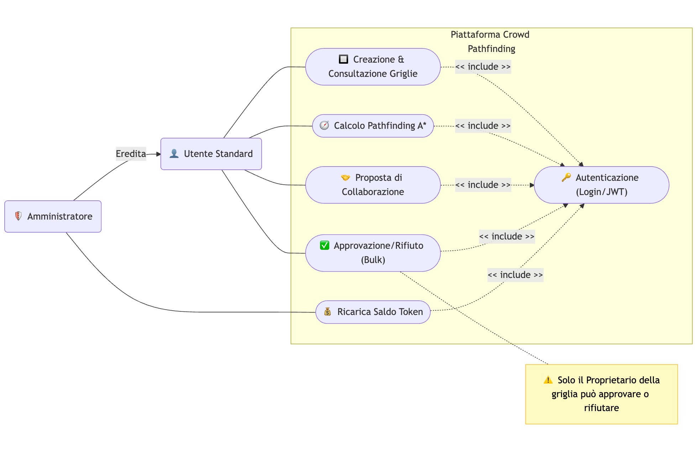
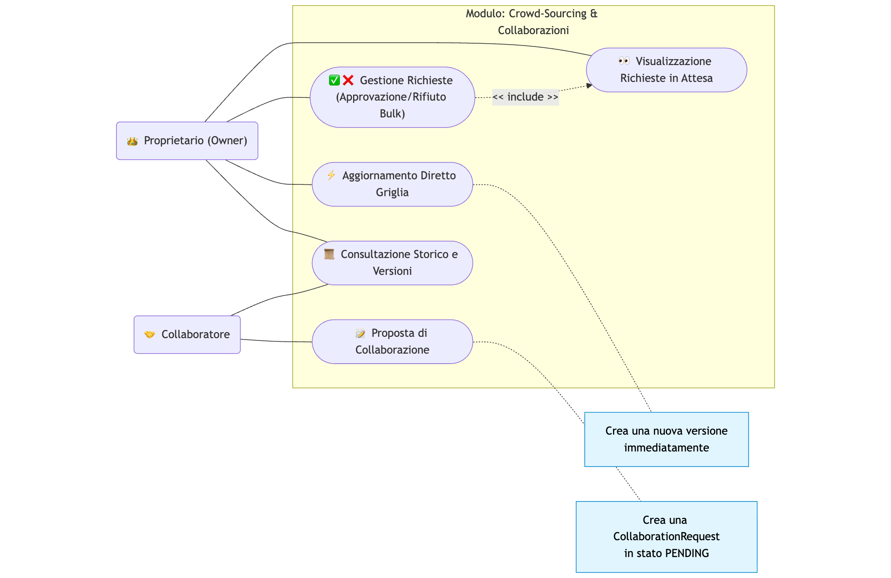
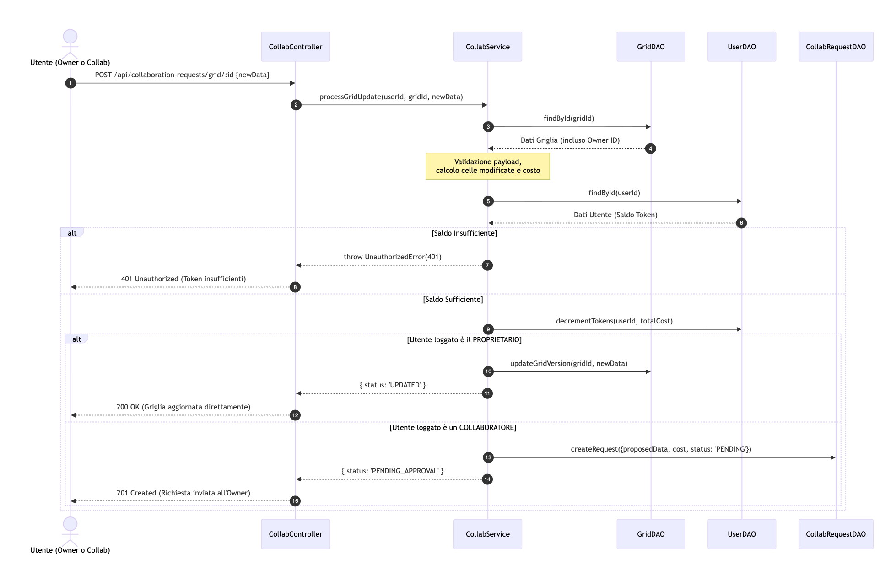
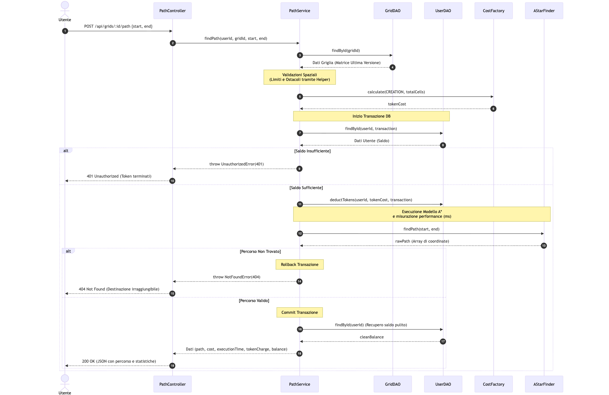
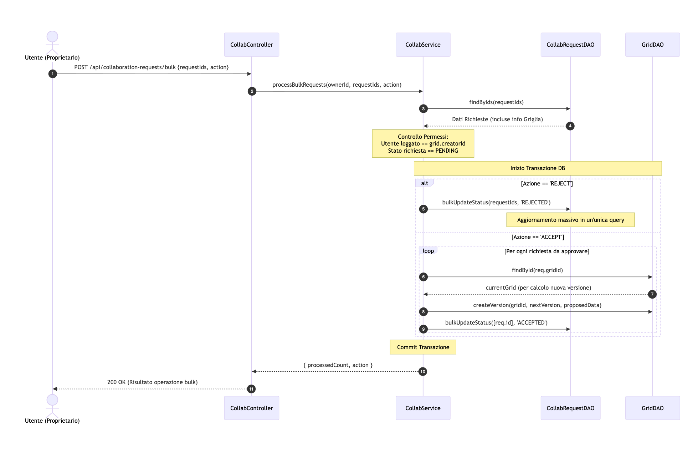
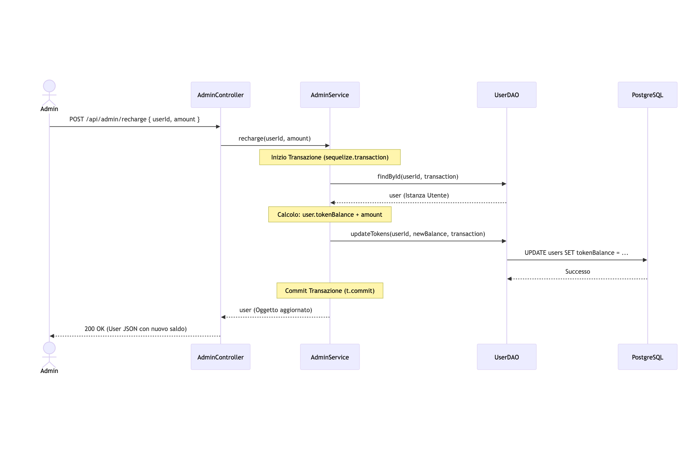
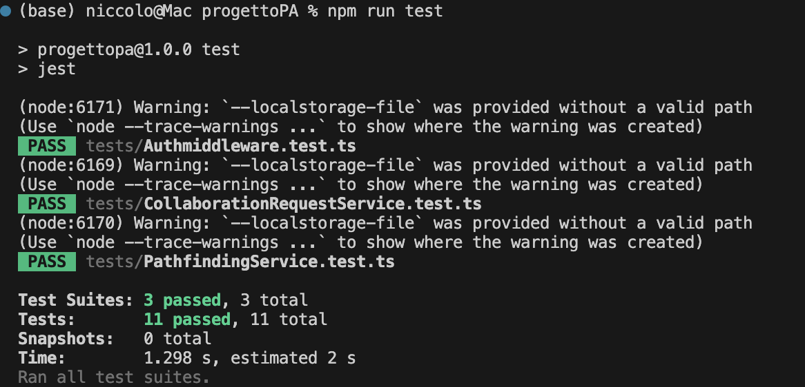

# 🗺️ Crowd Pathfinding Platform

[](https://www.postgresql.org/)
[](https://nodejs.org/en)
[](https://sequelize.org/)
[](https://expressjs.com/it/)
[](https://jwt.io/)
[](https://www.typescriptlang.org/)
[](https://www.postman.com/)
[](https://www.docker.com/)

> **Progetto per il corso di Programmazione Avanzata (A.A. 2024/2025).**

## 1. Descrizione e Obiettivi del Progetto

Il progetto nasce dall'esigenza di realizzare un sistema distribuito per la **gestione, creazione e valutazione di modelli di ricerca percorso su griglia**.

Come da specifiche, l'architettura è progettata per simulare uno scenario di **Crowd-Sourcing**, in cui la topologia delle griglie e la percorribilità delle celle non sono statiche, ma evolvono grazie ai contributi attivi degli utenti. Il sistema permette di modellare scenari reali (es. tempi di percorrenza) attraverso una matrice di costi dinamica.

###  Pilastri Funzionali
L'applicazione soddisfa i requisiti attraverso tre componenti principali:

* **Gestione Matrici (Grid Management):**
    Il cuore del sistema è la manipolazione di griglie bidimensionali dove gli utenti possono definire percorsi e ostacoli (valori binari 0/1). Questo permette di mappare ostacoli fisici o variazioni di percorribilità in tempo reale.

* **Crowd-Sourcing e Collaborazione:**
    Per concretizzare il concetto di "contributo attivo", il sistema implementa un flusso di **Richieste di Collaborazione**. Gli utenti non operano in isolamento, ma possono richiedere l'accesso in scrittura alle griglie di altri utenti (previa approvazione), permettendo un aggiornamento condiviso e decentralizzato della mappa.

* **Valutazione e Token Economy:**
    Il calcolo del percorso ottimo (implementato tramite algoritmo **A\***) non è gratuito, ma regolato da un sistema economico a **Token**. Ogni calcolo ha un costo computazionale simulato che viene addebitato al richiedente, regolando l'accesso al servizio in base alla disponibilità di credito e introducendo, di conseguenza, la necessità di un ruolo amministrativo per l'erogazione delle risorse.

###  Qualità del Software e Scelte Progettuali
Il sistema è stato progettato con un forte orientamento verso **scalabilità, sicurezza e flessibilità**. LL'integrazione con Docker e la gestione non bloccante dell'I/O (tipica di Node.js) assicurano scalabilità e reattività del sistema, mentre l'integrità della piattaforma è protetta da autenticazione JWT e una validazione rigorosa dei dati in ingresso. Infine, l'adozione di pattern garantisce un codice pulito, manutenibile ed estensibile nel tempo.

---

## 2. Tecnologie utilizzate

- **Node.js** & **Express.js** – per la creazione del server RESTful.
- **TypeScript** – per tipizzazione forte e maggiore robustezza.
- **PostgreSQL** – come database relazionale.
- **Sequelize** – ORM per la gestione del database.
- **JWT (JSON Web Tokens)** – per autenticazione e gestione sessioni.
- **Jest** – per l’esecuzione di test automatici.
- **Docker** & **Docker Compose** – per ambienti di sviluppo e distribuzione coerenti.
- **Postman** – per test manuali delle API.

---

## 3. Progettazione e UML

Per modellare il comportamento del sistema e le interazioni dei vari componenti, sono stati realizzati i diagrammi UML delle funzionalità principali.

### Diagramma dei Casi d'Uso 
Il diagramma seguente illustra le interazioni principali tra i due attori del sistema (**User** e **Admin**) e la piattaforma.



Per illustrare la gestione dei permessi a livello di singola risorsa, il seguente diagramma modella il flusso di Crowd-Sourcing. Evidenzia la biforcazione logica tra le azioni consentite al Creatore della griglia (Owner) e quelle consentite agli altri utenti (Collaboratori)



---

### Diagrammi delle Sequenze

| Endpoint (Descrizione) | Immagine |
|------------------------|----------|
| `POST /api/collaboration-requests/grid/:id`<br>*(Modifica Griglia o Proposta Collaborazione)* |  |
| `POST /api/grids/:id/path`<br>*(Calcolo Pathfinding A* e Gestione Token)* |  |
| `POST /api/collaboration-requests/bulk`<br>*(Approvazione/Rifiuto "Bulk" Richieste)* |  |
|`POST /api/admin/recharge`<br>*(Ricarica Token)*||
|`Pipeline di Sicurezza`||

---

## 4. Design Pattern e Architettura del Codice

Il sistema è stato realizzato seguendo i principi della **Architettura a Strati** e applicando **Design Pattern** per garantire un codice disaccoppiato, testabile e facilmente manutenibile.

### Il Flusso Controller - Service - DAO - Model

* **1. Controllers (`src/controllers/`): Il Livello di Presentazione API**
  I Controller fungono da "vigili urbani" dell'applicazione. Il loro unico scopo è intercettare la richiesta HTTP (gestita da Express.js), estrarre i parametri o il body (`req.params`, `req.body`), invocare il Service competente e, infine, impacchettare il risultato in una risposta HTTP formattata in JSON (es. `res.status(200).json(...)`). **Non contengono mai logica di business.**

* **2. Service Layer (`src/services/`): Il Cuore Logico**
  È il fulcro dell'applicazione. Qui risiede tutta la **Business Logic** (es. esecuzione dell'algoritmo A*, calcolo dei costi dei token, validazione delle regole di dominio). 
  *Vantaggio:* I Service sono completamente agnostici rispetto al framework web (non conoscono `req` o `res`). Questo li rende facilmente testabili (tramite Jest) e riutilizzabili da eventuali interfacce diverse in futuro (es. CLI o WebSockets).

* **3. DAO (Data Access Object - `src/dao/`): L'Astrazione del Database**
  Il pattern DAO funge da barriera tra la logica di business e il database. I Service non scrivono mai query dirette, ma delegano le operazioni CRUD ai DAO.
  *Vantaggio:* Gestione centralizzata delle **Transazioni** (per garantire l'atomicità delle operazioni finanziarie) e utilizzo di metodi sicuri contro le *race conditions* (es. il metodo `decrement` per scalare i token in modo nativo sul DB).

* **4. Models (`src/models/`): La Rappresentazione dei Dati**
  Livello più profondo dell'architettura. Contiene le classi Sequelize che definiscono lo schema delle tabelle PostgreSQL, i tipi di dato e le relazioni (Foreign Keys) tra le entità (es. relazione 1-a-N tra Utente e Griglie).

---

### Altri Pattern Utilizzati

#### Factory Pattern (CostFactory)
Per gestire in modo flessibile il calcolo dei token, è stato implementato un `CostFactory`. Questo modulo espone metodi statici per calcolare dinamicamente i costi in base al tipo di operazione (es. creazione griglia, esecuzione A*, aggiornamento celle), centralizzando la "Token Economy". La motivazione risiede nella manutenibilità: se i costi o le logiche di calcolo dovessero cambiare, l'intervento sarebbe limitato a un unico punto dell'applicazione.

#### Singleton Pattern (Database Connection)
L'istanza di connessione al database PostgreSQL (tramite Sequelize) è gestita come un Singleton. Questo garantisce che l'intera applicazione condivida un unico pool di connessioni, ottimizzando le risorse del server ed evitando memory leaks. Questa scelta è motivata dalla necessità di prevenire l'apertura di connessioni multiple ridondanti, che saturerebbero rapidamente le risorse del database PostgreSQL.

#### Chain of Responsibility 
Il pattern comportamentale *Chain of Responsibility* è stato applicato in modo nativo tramite i middleware di Express.js. La pipeline di elaborazione delle richieste attraversa una catena di controlli indipendenti (es. parsing del body, validazione del token JWT in `authMiddleware`, intercettazione degli errori). Ogni anello della catena decide autonomamente se elaborare la richiesta, interromperla restituendo un codice di stato (es. 401, 403), o passarla al modulo successivo tramite la funzione `next()`. La motivazione principale è garantire il principio di "Single Responsibility": ogni middleware si occupa di un'unica validazione, rendendo la pipeline di sicurezza estremamente modulare e facile da estendere. Per una visualizzazione tecnica di questo pattern, si rimanda al **Diagramma di Sequenza dell'Autenticazione** presente nella sezione UML.

---

## 4. Installazione e Avvio

Il sistema è interamente containerizzato tramite **Docker**, il che permette di avviare l'intero ecosistema in pochi istanti.

### Clonazione del Repository

Per prima cosa, scarica il progetto sul tuo computer:
 ```bash
 git clone https://github.com/grannico/ProgrammazioneAvanzata-2024-2025.git
 ```

 ### Variabili di Ambiente
 Crea un file `.env` da inserire nella root di progetto, basato sull'esempio fornito. Di seguito è mostrato un esempio di file .env: 

 ```properties
# URL di connessione al database PostgreSQL
# Formato: postgres://<username>:<password>@db:5432/<nome_database>
DB_URL=postgres://nome_utente:password_segreta@db:5432/nome_database

# Chiave segreta per la firma dei token JWT
JWT_SECRET=inserisci_una_stringa_casuale_e_sicura

# Porta su cui resterà in ascolto il server
PORT=3000
```

### Esecuzione con Docker Compose
Una volta configurate le variabili di ambiente, è possibile buildare le immagini e avviare l'intero ecosistema con un unico comando eseguito dalla `root` del progetto: 

```bash
docker-compose up --build
```

--- 

## Popolamento del Database (Seed)
Al primo avvio, il database risulterà vuoto. Per poter testare immediatamente le funzionalità (come l'accesso dell'Amministratore o l'utilizzo delle griglie predefinite), è necessario eseguire lo script di seeding all'interno del container dell'applicazione:

```bash
docker-compose exec app npm run seed
```

Questo comando provvederà a inserire nel database:

* **Un utente con ruolo ADMIN**: necessario per effettuare le operazioni di ricarica dei token.
* **Alcuni utenti STANDARD**: profili di test per simulare l'utilizzo dell'app da parte degli utenti.
* **Una serie di Griglie pre-configurate**: mappe di diverse dimensioni con ostacoli già posizionati per testare l'algoritmo A*.

--- 

## 5. Test del progetto
Il progetto include una serie di test automatizzati sviluppatti con **Jest** per garantire la robustezza della logica di business e l'integrità delle API. Per eseguire i test, utilizza il comando 

```bash
docker-compose exec app npm test
```

Attualmente, la suite comprende 11 test case suddivisi in 3 aree:

* **AuthMiddleware** (`Authmiddleware.test.ts`): verifica il corretto funzionamento delle barriere di sicurezza, assicurandosi che le richieste senza token JWT valido o scaduto vengano respinte con un errore `Unauthorized`, e che i token validi estraggano correttamente i dati dell'utente.

* **PathfindingService** (`PathfindingService.test.ts`):
controlla che il calcolo del percorso eviti gli ostacoli, gestisca correttamente coordinate fuori dai confini e, soprattutto, verifichi che i token dell'utente vengano scalati correttamente (bloccando l'operazione se il saldo è insufficiente).

* **CollaborationRequestService**(`CollaborationRequestService.test.ts`): garantisce che il sistema di permessi per la modifica delle griglie funzioni correttamente. Verifica che il "Creatore" possa aggiornare la griglia immediatamente, mentre le modifiche proposte da un "Collaboratore" generino una richiesta in stato PENDING.

**Risultati**

Di seguito è riportato l'esito dei test



---

## Test delle API

Per facilitare la valutazione e l'esplorazione degli endpoint REST, nel repository sono inclusi due file pronti per l'utilizzo con **Postman**:
1. La Collection con le rotte: `ProgettoPA.postman_collection.json`
2. L'Environment preconfigurato: `Progetto_Full_Test.postman_environment.json`

> **Nota sui Test:** Alcuni test di registrazione potrebbero fallire se eseguiti più volte consecutivamente senza aver ripulito il database, a causa dei vincoli di unicità sulle email. Per un test "clean", si consiglia di riavviare i container o modificare le variabili email nell'environment.

### Elenco delle Rotte API
Di seguito una panoramica degli endpoint disponibili e testabili tramite la Collection fornita:

| Metodo | Endpoint | Descrizione | Autenticazione |
| :--- | :--- | :--- | :--- |
| **Auth & Users** | | | |
| `POST` | `/api/auth/register` | Registrazione di un nuovo utente STANDARD | Public |
| `POST` | `/api/auth/login` | Autenticazione e rilascio del token JWT | Public |
| `GET`  | `/api/users/me` | Recupero profilo e saldo token dell'utente loggato | Bearer Token |
| **Admin** | | | |
| `POST` | `/api/admin/register-admin`| Creazione di un nuovo utente ADMIN | Admin |
| `POST` | `/api/admin/recharge` | Ricarica dei token di un utente specifico | Admin |
| **Grids & Pathfinding** | | | |
| `GET`  | `/api/grids` | Elenco di tutte le griglie disponibili | Bearer Token |
| `POST` | `/api/grids` | Creazione di una nuova griglia (Costo: 0.05 * celle) | Bearer Token |
| `GET`  | `/api/grids/:id` | Dettagli di una singola griglia e sue versioni | Bearer Token |
| `POST` | `/api/grids/:id/path` | Calcolo del percorso ottimo A* (Costo: 0.05 * celle) | Bearer Token |
| **Crowd-Sourcing (Collaboration)** | | | |
| `POST` | `/api/collaboration-requests/grid/:id` | Modifica diretta (Owner) o Proposta coll. (Collaboratore) | Bearer Token |
| `GET`  | `/api/collaboration-requests/my-pending` | Lista delle richieste in sospeso per le griglie possedute | Bearer Token |
| `POST` | `/api/collaboration-requests/bulk` | Approvazione/Rifiuto massivo delle richieste pendenti | Bearer Token |
| `GET`  | `/api/collaboration-requests/grid/:id/status`| Verifica dello stato delle richieste su una singola griglia | Bearer Token |
| `GET`  | `/api/collaboration-requests/grid/:id/history`| Storico delle richieste con filtri (data/stato) | Bearer Token |

---
